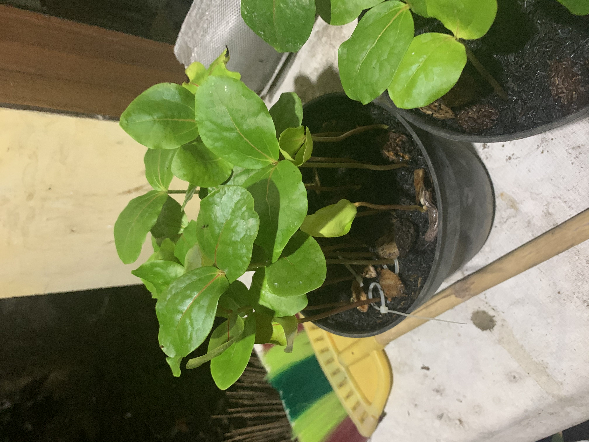

<style>
    h2{
        text-align:center;
    }
    html,body{
        font-family:Helvetica;
    }
   .identitas{
    font-family:Helvetica;
    font-weight:bold;
    font-size:18px;
   }
</style>
<div class="identitas">
    <p>Nama : Reza Arya Wijaya</p>
    <p>Kelas : TI-2E</p>
    <p>NIM : 2241720252</p>
</div> 

---

## Jobsheet 1 (Pengenalan PBO)

### Percobaan jobsheet
\
**Class Sepeda**

```java
public class Sepeda {
    private String merek;
    private int kecepatan;
    private int gear;

    public void setMerek(String newValue){
        merek = newValue;
    }

    public void gantiGear(int newValue){
        gear = newValue;
    }

    public void tambahKecepatan(int increment){
        kecepatan = kecepatan + increment;
    }

    public void rem(int decrement){
        kecepatan = kecepatan - decrement;
    }

    public void cetakStatus(){
        System.out.println("Merek: "+merek);
        System.out.println("Kecepatan: "+kecepatan);
        System.out.println("Gear: "+gear);
    }
}
```

**Class SepedaDemo**

```java
public class SepedaDemo{
    public static void main(String[] args) {
        Sepeda spd1 = new Sepeda();
        Sepeda spd2 = new Sepeda();
        SepedaGunung spd3 = new SepedaGunung();

        spd1.setMerek("Polygone");
        spd1.tambahKecepatan(10);
        spd1.gantiGear(2);
        spd1.cetakStatus();

        spd2.setMerek("Wiim Cycle");
        spd2.tambahKecepatan(10);
        spd2.gantiGear(2);
        spd2.tambahKecepatan(10);
        spd2.gantiGear(3);
        spd2.cetakStatus();

        spd3.setMerek("Klinee");
        spd3.tambahKecepatan(5);
        spd3.gantiGear(7);
        spd3.setTipeSuspensi("Gas suspension");
        spd3.cetakStatus();
    }
}
```
**Class SepedaGunung**

```java
public class SepedaGunung extends Sepeda{
    private String tipeSuspensi;

    public void setTipeSuspensi (String newValue){
        tipeSuspensi = newValue;
    }

    public void cetakStatus(){
        super.cetakStatus();
        System.out.println("Tipe suspensi: "+tipeSuspensi);
    }
}
```
**Output**


### Pertanyaan
<span style="color: #ff8000;">**1. Jelaskan perbedaan antara objek dengan class!**</span>\
    Objek adalah suatu benda atau entitas yang memiliki atribut dan dapat dibedakan berdasarkan atributnya, sedangkan class merupakan kerangka dari sebuah objek dan belum mempunyai sebuah atribut\
    \
<span style="color: #ff8000;">**2. Jelaskan alasan warna dan tipe mesin dapat menjadi atribut dari objek mobil!**</span>\
    Alasan mengapa warna dan tipe mesin dapat menjadi atribut dari objek mobil adalah karena warna dari tiap mobil bisa jadi berbeda beda dan tipe mesin dari tiap mobil juga berbeda beda, sehingga warna dan tipe mesin bisa dijadikan atribut objek mobil.\
\
<span style="color:#ff8000;">**3. Sebutkan salah satu kelebihan utama dari pemrograman berorientasi objek dibandingkan dengan pemrograman struktural!**</span>\
    Salah satu keuntungan utama dari pbo adalah ketika terjadi suatu error dalam program maka kita bisa langsung menuju ke objek yang bermasalah, dan juga dengan pbo kita bisa membuat panjang kode program menjadi lebih singkat.\
    \
<span style="color:#ff8000;">**4. Apakah diperbolehkan melakukan pendefinisian dua buah atribut dalam satu baris kode seperti "public String nama, alamat;"?**</span>\
    Selama tipe data dari sebuah atribut tersebut sama, maka sah-sah saja jika ingin didefinisikan dalam satu baris kode seperti contoh di atas.\
\
<span style="color:#ff8000;">**5. Pada class SepedaGunung, jelaskan alasan atribut merk, kecepatan, dan gear tidak lagi ditulis di dalam class tersebut!**</span>\
    Karena class SepedaGunung merupakan inheritance, yang mana class ini mewarisi atribut yang ada di class Sepeda, sehingga kita tidak perlu menuliskan merek, kecepatan, dan gear dalam class SepedaGunung.

### Tugas Praktikum

1. **Lakukan langkah-langkah berikut supaya tugas praktikum yang dikerjakan tersistematis:**\
* Foto Objek\
        - Jaket\
        \
        - Jaket Lari\
        \
        - Jaket Gunung\
        \
        - Charger\
        - Pot Bunga\
        \
* Analisa Objek\
        - Jaket\
            Atribut: Merk, Ukuran, Ketebalan\
            Method: setMerk, setUkuran, setKetebalan, cetakBarang\
            \
        - Jaket Lari\
            Atribut: Fitur, Jumlah Saku\
            Method: setFitur, setSaku, cetakBarang\
            \
        - Jaket Gunung\
            Atribut: Bahan, Ketahanan\
            Method: setBahan, setKetahanan, cetakBarang\
            \
        - Pot Bunga\
            Atribut: Diameter, Warna, Bahan, Merk\
            Method: setDiameter, setWarna, setBahan, setMerk, cetakStatus\
            \
        - Charger\
            Atribut: Tipe USB, Output, Tipe Charge\
            Method: setTipeUSB, set Output, setTipeCharge, cetakStatus

* Implementasi Coding

    Class Jaket
    ```java
    public class Jaket{
        private String Merk;
        private char Ukuran;
        private String Ketebalan;

        public void setMerk(String Merk){
            this.Merk = Merk;
        }

        public void setUkuran(char Ukuran){
            this.Ukuran = Ukuran;
        }

        public void setKetebalan(String Ketebalan){
            this.Ketebalan = Ketebalan;
        }

        public void cetakBarang(){
            System.out.println("Merk Jaket: "+Merk);
            System.out.println("Ukuran: "+Ukuran);
            System.out.println("Ketebalan Jaket: "+Ketebalan);
        }
    }
    ```
    Class Jaket Lari
    ```java
    public class JaketLari extends Jaket{
        private String fitur;
        private int jumlahSaku;

        public void setFitur(String fitur){
            this.fitur = fitur;
        }

        public void setSaku(int saku){
            jumlahSaku = saku;
        }

        public void cetakBarang(){
            super.cetakBarang();
            System.out.println("Fitur: "+fitur);
            System.out.println("Jumlah Saku: "+jumlahSaku);
        }
    }

    ```
    Class Jaket Gunung
    ```java
    public class JaketGunung extends Jaket{
        private String bahan;
        private String ketahanan;

        public void setBahan(String bahan){
            this.bahan = bahan;
        }

        public void setKetahanan(String ketahanan){
            this.ketahanan = ketahanan;
        }

        public void cetakBarang(){
            super.cetakBarang();
            System.out.println("Bahan: "+bahan);
            System.out.println("Ketahanan: "+ketahanan);
        }
    }
    ```
    Class JaketDemo
    ```Java
    public class JaketDemo {
        public static void main(String[] args) {
            Jaket jkt = new Jaket();
            JaketLari jkl = new JaketLari();
            JaketGunung jkg = new JaketGunung();

            jkt.setMerk("Emba Jeans");
            jkt.setUkuran('L');
            jkt.setKetebalan("Sedang");
            jkt.cetakBarang();
            System.out.println("");

            jkl.setMerk("Rainsol");
            jkl.setUkuran('L');
            jkl.setKetebalan("Tipis");
            jkl.setFitur("Penutup kepala, Stopper tali");
            jkl.setSaku(2);
            jkl.cetakBarang();
            System.out.println();

            jkg.setMerk("Consina");
            jkg.setUkuran('M');
            jkg.setKetebalan("Tebal");
            jkg.setBahan("Duratex Polyester");
            jkg.setKetahanan("Tahan air, Tahan terpaan angin");
            jkg.cetakBarang();
        }
    }

    ```
    Class PotBunga
    ```java
    public class PotBunga {
        private int diameter;
        private String warna;
        private String bahan;
        private String merk;

        public void setDiameter(int diameter){
            this.diameter = diameter;
        }

        public void setWarna(String warna){
            this.warna = warna;
        }

        public void setBahan(String bahan){
            this.bahan = bahan;
        }

        public void setMerk(String merk){
            this.merk = merk;
        }

        public void cetakStatus(){
            System.out.println("Merk: "+merk);
            System.out.println("Diameter (cm): "+diameter);
            System.out.println("Warna: "+warna);
            System.out.println("Bahan: "+bahan);
        }
    }

    ```
    Class PotBungaDemo
    ```java
    public class PotBungaDemo {
        public static void main(String[] args) {
            PotBunga ptb = new PotBunga();

            ptb.setMerk("Lion Star");
            ptb.setDiameter(30);
            ptb.setWarna("Oranye");
            ptb.setBahan("Plastik");
            ptb.cetakStatus();
        }
    }

    ```
    Class Charger
    ```java
    public class Charger {
        private String tipeUSB;
        private float output;
        private String tipeCharging;

        public void setTipeUSB(String USB){
            tipeUSB = USB;
        }

        public void setOutput(float output){
            this.output = output;
        }

        public void tipeCharge(String tipeCharge){
            tipeCharging = tipeCharge;
        }

        public void cetakStatus(){
            System.out.println("Tipe USB: "+tipeUSB);
            System.out.println("Output: "+output+"V");
            System.out.println("Tipe Charge: "+tipeCharging);
        }
    }

    ```
    Class ChargerDemo
    ```java
    public class ChargerDemo {
        public static void main(String[] args) {
            Charger cgr = new Charger();

            cgr.setTipeUSB("Type C");
            cgr.setOutput(9.5f);
            cgr.tipeCharge("Fast Charging");
            cgr.cetakStatus();
        }
    }
    ```
    d. Output
    
    Class JaketDemo\
    

    Class ChargerDemo\
    

    Class PotBungaDemo\
    
